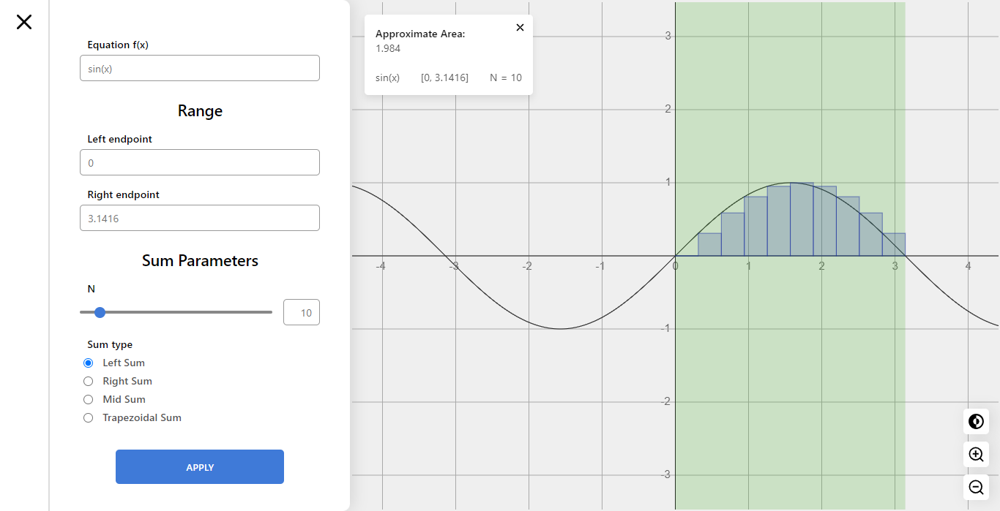
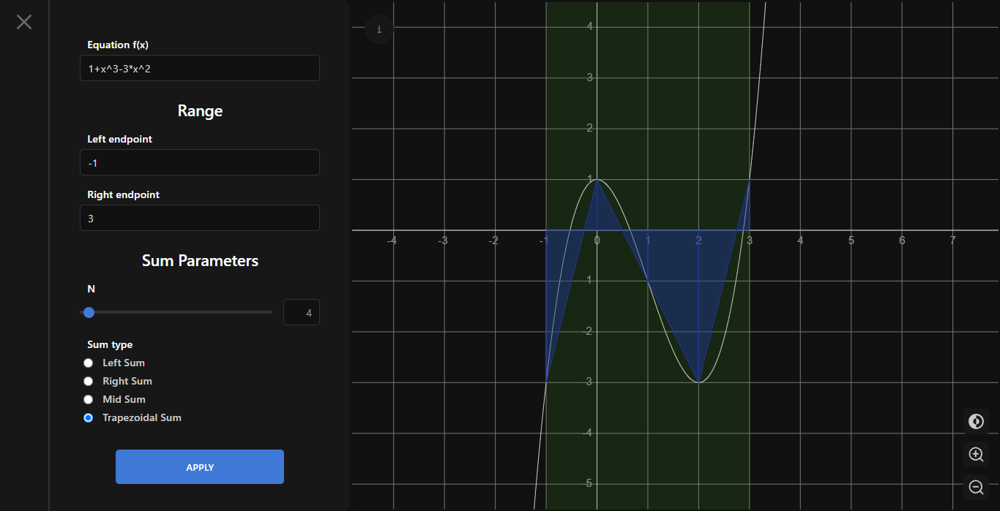
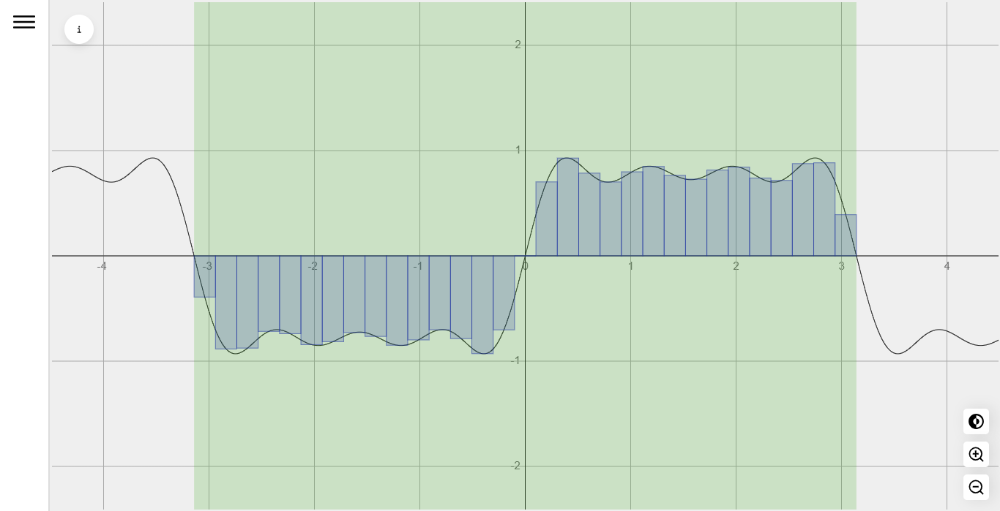

# riemann-sum-visualizer

Webpage to visualize the Riemann left, right, mid and trapezoidal Sum of custom Mathematical Functions.

[Link to Web](https://juansoriae.github.io/riemann-sum-visualizer/)

## Screenshots
### Home

### Dark mode

### Full-screen

